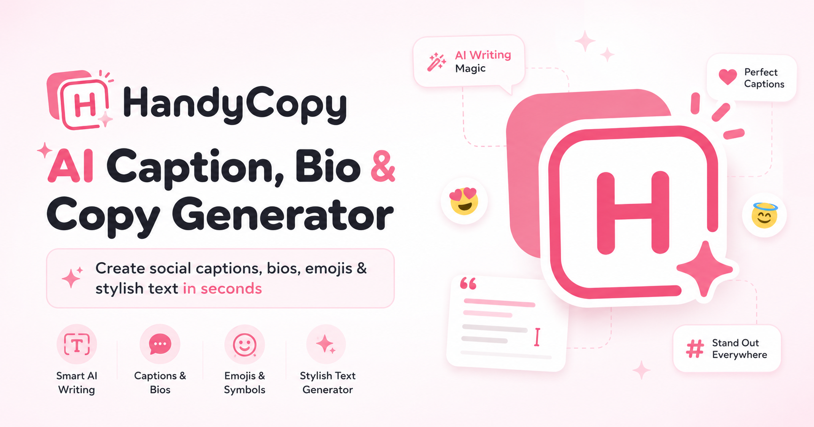

# HandyCopy

**HandyCopy** is an AI-powered social media caption generator and creative copy tool — built for content creators who want to move fast.

🔗 **Live Demo:** https://handy-copy-nine.vercel.app/

---



---

## Features

### ✨ Caption Lab (AI)
- Chat with an AI assistant to generate social media captions, bios, and post ideas
- **Multi-turn conversation** — refine and adjust captions through natural dialogue
- **Auto language detection** — responds in the same language as your message (English, Korean, Japanese, etc.)
- Platform-aware output: Instagram, TikTok, YouTube, Twitter/X, Bio
- **Regenerate on dislike** — click 👎 to instantly get a rewritten version in a different style
- Copy any caption with one click

### 😊 Emoji Library
- Browse hundreds of emojis organized by category
- Instant copy on click
- Recently used emojis saved automatically

### ( ´ ▽ ` ) Kaomoji
- Japanese-style text emoticons grouped by mood
- Search by keyword or expression

### 𝔽𝕒𝕟𝕔𝕪 Fonts
- Convert any text into Unicode decorative font styles
- Preview all styles in real time as you type
- One-click copy per style

---

## Tech Stack

| Layer | Technology |
|---|---|
| Frontend | React 19, TypeScript, Vite |
| Styling | Tailwind CSS |
| AI | Anthropic Claude API (`claude-haiku-4-5`) |
| Backend | Vercel Serverless Functions |
| Analytics | Vercel Analytics, Vercel Speed Insights |
| Storage | localStorage (recent emojis / kaomoji) |
| Deployment | Vercel |

---

## How Caption Lab Works

User messages are sent to a Vercel serverless function (`/api/generate-captions`), which calls the Anthropic Claude API with the full conversation history. The AI returns a structured JSON response with the caption text and an `isCaption` flag used to control copy/feedback UI.

```
User → Vercel Serverless Function → Anthropic Claude API → JSON → UI
```

Conversation history lives in the browser session only — no database, no account required.

---

## Privacy

- No login or account required
- Conversation history exists only in your current browser session and clears on refresh
- Caption messages are processed via the Anthropic API — avoid sharing sensitive personal information
- Emoji/kaomoji/font preferences are stored locally via `localStorage` only

---

## Local Development

```bash
# Install dependencies
npm install

# Add your Anthropic API key
echo "ANTHROPIC_API_KEY=your_key_here" > .env

# Start dev server
npm run dev
```

The dev server runs at `http://localhost:3000`. The Caption Lab feature requires a valid `ANTHROPIC_API_KEY`.

---

## Design

HandyCopy uses a **Soft Retro Pink** design system — pastel colors, 3D game-style buttons, and rounded cards. The goal is a tool that feels polished and playful without being childish.

---

Made by [@songxinwei64](https://github.com/songxinwei64)
